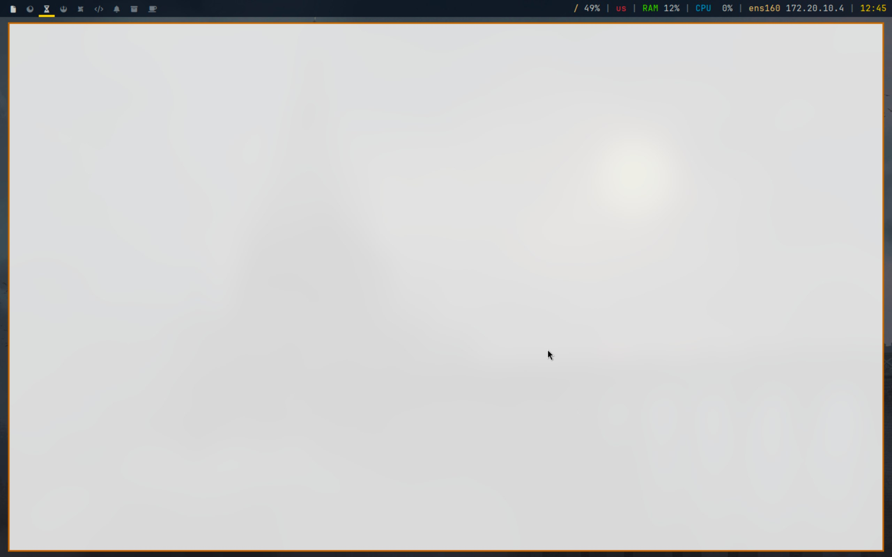
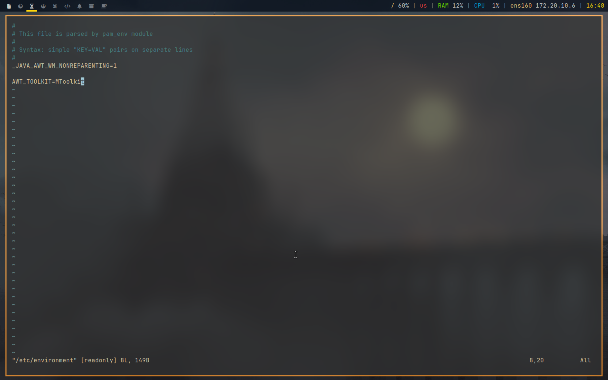
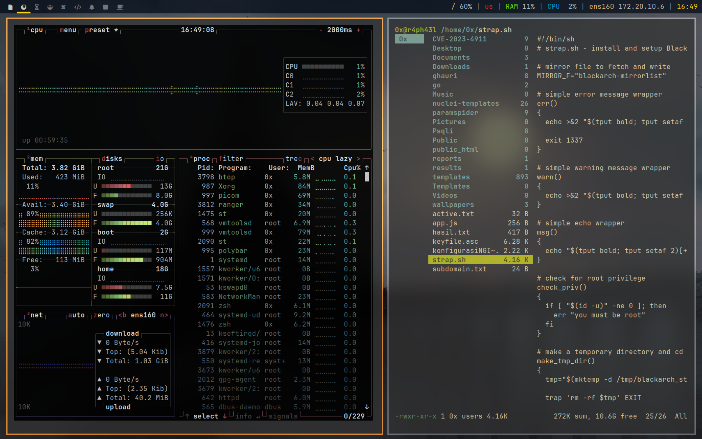

Errors are normal for Arch Linux users, that's everyday food, we will always learn new things, read some documentation, read write-ups, compile some configurations, understand the structure, learn some programming languages, and so on. These are all good things for us because with Arch Linux, we will always be learning, and always want to know about everything.

in this case, (Java) can be seen in this documentation [article](https://wiki.archlinux.org/title/Java#).

<!--more-->



### ****Gray window, applications not resizing with WM, menus immediately closing****

The standard Java GUI toolkit has a hard-coded list of "non-reparenting" window managers. If using one that is not on that list, there can be some problems with running some Java applications. One of the most common problems is "gray blobs", when the Java application renders as a plain gray box instead of rendering the GUI. Another one might be menus responding to your click, but closing immediately.

There are several things that may help:

- See **[#Impersonate another window manager](https://wiki.archlinux.org/title/Java#Impersonate_another_window_manager)**.
- For **[jre8-openjdk](https://archlinux.org/packages/?name=jre8-openjdk)**, set the `_JAVA_AWT_WM_NONREPARENTING=1` **[environment variable](https://wiki.archlinux.org/title/Environment_variable)**.
- For later versions, set the `AWT_TOOLKIT=MToolkit` **[environment variable](https://wiki.archlinux.org/title/Environment_variable)**.
- For **[xmonad](https://wiki.archlinux.org/title/Xmonad)**, use **[SetWMName](https://wiki.haskell.org/Xmonad/Frequently_asked_questions#Using_SetWMName)**. However, its effect may be canceled when also using `XMonad.Hooks.EwmhDesktops`. In this case, appending `>> setWMName "LG3D"` to the `LogHook` may help.

See **[[1]](https://wiki.haskell.org/Xmonad/Frequently_asked_questions#Problems_with_Java_applications.2C_Applet_java_console)** for more information.



### ****System freezes when debugging JavaFX Applications****

If your system freezes while debugging a JavaFX Application, you can try to supply the JVM option `-Dsun.awt.disablegrab=true`.

See **https://bugs.java.com/bugdatabase/view_bug?bug_id=6714678**

### ****JavaFX's MediaPlayer constructor throws an exception****

Creating instance of MediaPlayer class from JavaFX's sound modules might throw following exception (both Oracle JDK and OpenJDK)

```
... (i.e. FXMLLoader construction exceptions) ...
Caused by: MediaException: UNKNOWN : com.sun.media.jfxmedia.MediaException: Could not create player! : com.sun.media.jfxmedia.MediaException: Could not create player!
 at javafx.scene.media.MediaException.exceptionToMediaException(MediaException.java:146)
 at javafx.scene.media.MediaPlayer.init(MediaPlayer.java:511)
 at javafx.scene.media.MediaPlayer.<init>(MediaPlayer.java:414)
 at <constructor call>
...

```

which is a result of some incompatibilities of JavaFX with modern **[ffmpeg](https://archlinux.org/packages/?name=ffmpeg)** build delivered within Arch Linux repository.

Working solution is to install **[ffmpeg-compat-55](https://aur.archlinux.org/packages/ffmpeg-compat-55/)**AUR.

See **https://www.reddit.com/r/archlinux/comments/70o8o6/using_a_javafx_mediaplayer_in_arch/**

### ****Java applications cannot open external links****

If a Java application is not able to open a link to, for example, your web browser, install **[gvfs](https://archlinux.org/packages/?name=gvfs)**. This is required by the Desktop.Action.BROWSE method. See **[[2]](https://bugs.launchpad.net/ubuntu/+source/openjdk-8/+bug/1574879/comments/2)**

### ****Error initializing QuantumRenderer: no suitable pipeline found****

Possible issues / solutions:

- GTK2 is missing. Install **[gtk2](https://archlinux.org/packages/?name=gtk2)**
- OpenJFX is missing. Install **[java-openjfx](https://aur.archlinux.org/packages/java-openjfx/)**AUR

